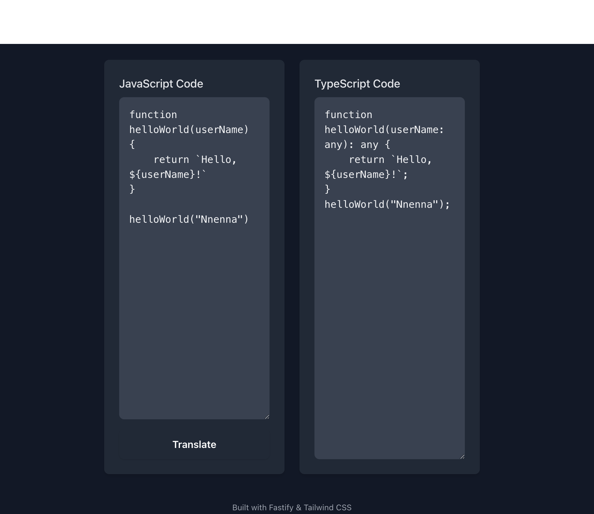

# JS to TS Translator

This is a simple TypeScript application built with Fastify and Tailwind CSS. It translates JavaScript code to TypeScript with basic transformations.

## Demo



Type or paste your JavaScript code in the left editor, click **Translate**, and view the generated TypeScript on the right.

## Setup

Before running the app, create a `.env` file in the project root with your OpenAI API key:
```
OPENAI_API_KEY=your_openai_api_key_here
```
1. Install dependencies:

   ```bash
   npm install
   ```

2. Start the development server:

   ```bash
   npm run dev
   ```

3. Open your browser at:

   ```
   http://localhost:3000
   ```

Type or paste your JavaScript code into the textarea, click "Translate", and view the generated TypeScript code.
